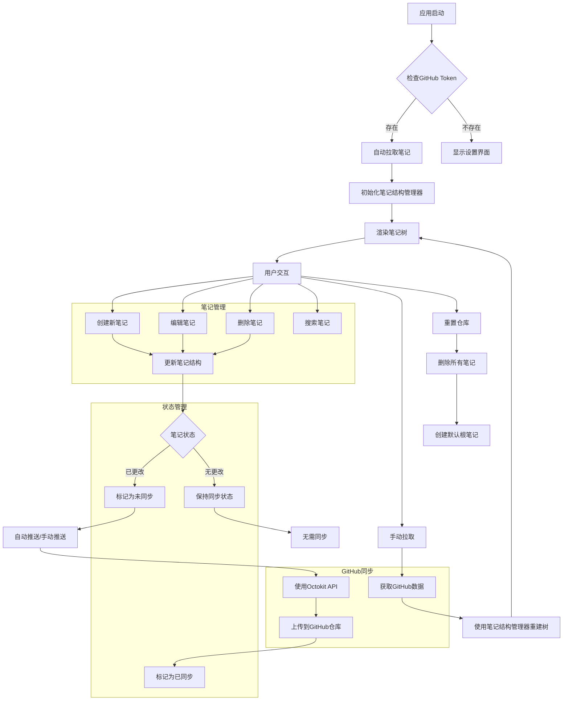

# Branchlet - 笔记应用

Branchlet 是一个基于 Tauri、React 和 TypeScript 构建的桌面笔记应用，具有 GitHub 同步功能。它允许您创建和管理分层笔记，并将笔记同步到 GitHub 仓库进行备份和跨设备访问。

## 功能特性

- **分层笔记管理**：以树形结构组织笔记，支持无限层级的子笔记
- **GitHub 同步**：自动将笔记同步到 GitHub 仓库进行备份和跨设备访问
- **实时编辑**：所见即所得的笔记编辑体验
- **本地存储**：所有笔记数据都存储在本地，确保隐私安全
- **跨平台支持**：支持 Windows、macOS 和 Linux 操作系统

## 技术栈

- [Tauri](https://tauri.app/) - 构建安全、快速且体积小的桌面应用程序
- [React](https://reactjs.org/) - 用于构建用户界面的 JavaScript 库
- [TypeScript](https://www.typescriptlang.org/) - JavaScript 的超集，添加了静态类型定义
- [Vite](https://vitejs.dev/) - 快速的构建工具
- chinese-lunar-calendar (农历计算)
- liquid-glass-react (玻璃拟态效果)
- levenshtein (编辑距离算法)
- framer-motion (动画效果)
- react-window (虚拟滚动)

## 推荐的 IDE 设置

- [VS Code](https://code.visualstudio.com/) + [Tauri](https://marketplace.visualstudio.com/items?itemName=tauri-apps.tauri-vscode) + [rust-analyzer](https://marketplace.visualstudio.com/items?itemName=rust-lang.rust-analyzer)

## 快速开始

### 前置要求

- [Node.js](https://nodejs.org/) (v16 或更高版本)
- [Rust](https://www.rust-lang.org/) (通过 rustup 安装)

### 安装依赖

```bash
npm install
```

### 项目依赖

#### 生产环境依赖

- `@heroui/react`: ^2.8.2
- `@octokit/rest`: ^20.0.0
- `@tauri-apps/api`: ^2
- `@tauri-apps/plugin-fs`: ^2.4.1
- `@tauri-apps/plugin-opener`: ^2
- `chinese-lunar`: ^0.1.4
- `chinese-lunar-calendar`: ^1.0.1
- `framer-motion`: ^12.23.12
- `liquid-glass-react`: ^1.1.1
- `react`: ^19.1.1
- `react-dom`: ^19.0.0
- `react-window`: ^1.8.11
- `uuid`: ^11.1.0

#### 开发环境依赖

- `@tauri-apps/cli`: ^2
- `@types/react`: ^19.0.0
- `@types/react-dom`: ^19.0.0
- `@types/react-window`: ^1.8.8
- `@types/uuid`: ^10.0.0
- `@vitejs/plugin-react`: ^4.3.4
- `typescript`: ~5.6.2
- `vite`: ^6.0.3

### 开发模式

```bash
npm run dev
```

### 构建应用

```bash
npm run build
```

### 预览构建

```bash
npm run preview
```

### 运行桌面应用

```bash
npm run tauri dev
```

### 构建桌面应用

```bash
npm run tauri build
```

## 发布应用

### 使用 publish.sh 脚本自动发布

项目包含一个 `scripts/publish.sh` 脚本，可以自动构建 Windows、macOS、Linux 平台的发行版，并将它们上传到 GitHub Releases。

### 前置要求

1. 安装必要的编译目标：

```bash
rustup target add aarch64-apple-darwin
rustup target add x86_64-unknown-linux-gnu
rustup target add x86_64-pc-windows-msvc
```

2. 创建 GitHub Personal Access Token：
   - 访问 [GitHub Token 设置页面](https://github.com/settings/tokens/new)
   - 选择适当的权限（至少需要 `repo` 权限）
   - 生成 token 并保存

### 使用方法

1. 设置环境变量：

```bash
export GITHUB_TOKEN=your_github_token
```

2. 运行发布脚本：

```bash
./scripts/publish.sh --repo-owner your-github-username --repo-name Branchlet --version 0.1.0
```

### 脚本功能说明

publish.sh 脚本会自动完成以下步骤：
- 检查必要的构建工具 (npm, cargo, curl)
- 清理之前的构建产物
- 为 macOS、Linux、Windows 构建应用
- 打包源代码
- 检查 GitHub 上是否已存在相同版本号的 Release
- 创建 GitHub Release
- 上传所有构建产物到 Release

如果在 GitHub 上检测到已存在相同版本号的 Release，脚本会显示已存在的版本备注信息，并询问是否替换。您可以选择替换已存在的版本或取消发布流程。

### 上传的文件

脚本会上传以下文件到 GitHub Release：
- macOS: `branchlet_0.1.0_aarch64.dmg`
- Linux: `branchlet_0.1.0_amd64.AppImage`
- Windows: `branchlet_0.1.0_x64_en-US.msi`
- 源代码包: `branchlet-src-0.1.0.tar.gz`

### 命令行参数

- `--repo-owner <用户名>`: GitHub 用户名 (默认: EricJiang1329145)
- `--repo-name <仓库名>`: GitHub 仓库名 (默认: Branchlet)
- `--version <版本号>`: 版本号 (默认: 0.1.0)
- `-h, --help`: 显示帮助信息

### 环境变量

- `GITHUB_TOKEN`: GitHub Personal Access Token，需要有 repo 权限

您也可以将环境变量保存在项目根目录的 `.env` 文件中，脚本会自动加载这些变量：

```bash
# .env 文件内容示例
GITHUB_TOKEN=your_github_token_here
```

注意：请确保将 `.env` 文件添加到 `.gitignore` 中，避免将敏感信息提交到代码仓库。

## GitHub 同步设置

Branchlet 支持将笔记自动同步到 GitHub 仓库进行备份和跨设备访问。

1. 在 GitHub 上创建一个 Personal Access Token：
   - 访问 [GitHub Token 设置页面](https://github.com/settings/tokens/new)
   - 选择适当的权限（至少需要 `repo` 权限）
   - 生成 token 并保存

2. 在应用中配置 GitHub 同步：
   - 点击界面右上角的"设置"按钮
   - 在弹出的设置框中输入您的 GitHub Personal Access Token
   - 点击"保存"按钮

3. 应用会自动创建一个名为 `Branchlet-nts` 的仓库用于存储笔记。

应用会在每次启动时自动从 GitHub 拉取最新的笔记，您也可以手动点击"拉取"按钮同步笔记。点击"推送"按钮可以将本地更改推送到 GitHub。

## 项目结构

```
src/
├── App.css           # 主应用样式
├── App.tsx           # 主应用组件
├── Clock.css         # 时钟组件样式
├── Clock.tsx         # 时钟组件
├── GithubSync.tsx    # GitHub 同步功能组件
├── NoteStructureManager.ts # 笔记结构管理器
├── assets/           # 静态资源
├── chinese-lunar-calendar.d.ts # 中文农历类型声明
├── levenshtein.ts    # 字符串相似度算法
├── main.tsx          # 应用入口点
├── types.ts          # 全局类型定义
└── vite-env.d.ts     # TypeScript 声明文件

src-tauri/
├── src/
│   ├── main.rs       # Tauri 后端主文件
│   └── lib.rs        # Tauri 命令模块
├── tauri.conf.json   # Tauri 配置文件
├── build.rs          # Rust 构建脚本
├── Cargo.toml        # Rust 依赖配置
└── capabilities/     # Tauri 权限配置
```

## 工作流程



## 核心组件

1. **App.tsx**: 主应用组件，负责整体状态管理和UI渲染
2. **GithubSync.tsx**: GitHub同步功能组件，处理与GitHub的交互
3. **NoteStructureManager.ts**: 笔记结构管理器，管理笔记的层级结构
4. **Clock.tsx**: 时钟组件，显示当前时间和农历
5. **levenshtein.ts**: 编辑距离算法实现，用于搜索功能

### App.tsx
- 管理笔记树状态
- 处理用户交互（创建、编辑、删除、搜索笔记）
- 与GithubSync组件通信
- 主题切换功能
- 用户活动状态管理

### GithubSync.tsx
- 使用Octokit与GitHub API交互
- 处理笔记的拉取和推送
- 管理GitHub Token和同步设置
- 提供重置仓库功能
- 自动同步定时器
- 删除指定笔记功能

### NoteStructureManager.ts
- 管理笔记的层级结构
- 提供添加、删除、移动笔记的方法
- 重建笔记树结构
- 管理笔记的父子关系
- 计算笔记路径

### Clock.tsx
- 显示当前时间（带翻页动画效果）
- 显示农历信息
- 显示星期和节假日

### levenshtein.ts
- 计算字符串编辑距离
- 计算搜索结果相似度

## 许可证

本项目采用 MIT 许可证 - 查看 [LICENSE](LICENSE) 文件了解详情。
