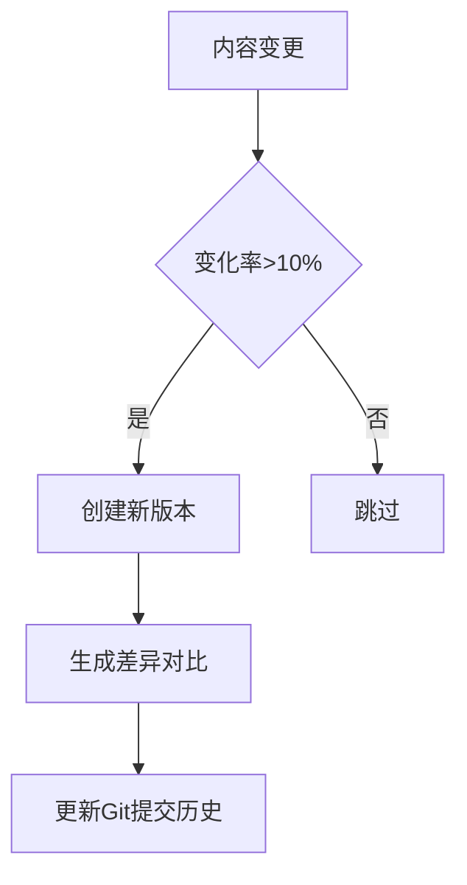

# 版本历史功能设计方案

## 核心功能
1. **Git集成**：利用现有GithubSync组件的提交记录实现版本追踪
2. **可视化时间轴**：在笔记编辑器添加版本历史面板
3. **智能快照**：基于内容变化率自动创建版本

## 技术实现

```mermaid
graph TD
    A[内容变更] --> B{变化率>10%}
    B -->|是| C[创建新版本]
    B -->|否| D[跳过]
    C --> E[生成差异对比]
    E --> F[更新Git提交历史]
```

## 界面原型
